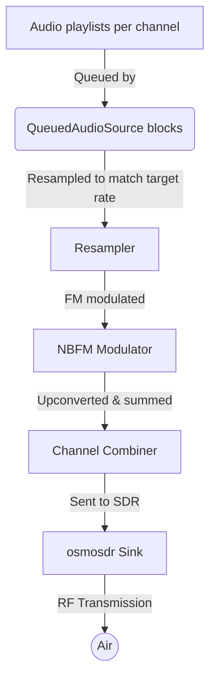

# ATE

Automated test engineering utilities focused on audio and RF experimentation.

## Multi-channel NBFM transmitter

This repository includes a multi-channel narrowband FM transmitter that can
drive HackRF, Pluto SDR, and PlutoPlus SDR devices.

### High-level workflow

1. Each logical channel keeps a playlist of WAV and/or MP3 files.
2. `QueuedAudioSource` reads the playlists, decodes audio, and performs optional
   sample-rate conversion so every stream matches the transmitter's base
   audio sample rate.
3. Individual channel audio is frequency shifted to its assigned offset or
   direct RF frequency, then modulated as narrowband FM.
4. All modulated channels are summed and forwarded to an `osmosdr` sink which
   pushes complex baseband samples to the connected SDR at the configured
   transmit sample rate and gain.

### Provided entry points

* `multich_nbfm_tx.py` – command-line transmitter that streams per-channel
  file queues (comma-separated file lists), optionally resamples mismatched
  audio sample rates on the fly, exposes per-channel gain trims, looping
  control, and either baseband offsets or direct frequency entry (`--freqs`).
* `multich_gui.py` – lightweight Tkinter GUI that wraps the transmitter so you
  can configure devices, FRS/GMRS channel selections, per-channel playlists,
  and gain levels without memorizing CLI arguments. Editable fields expose the
  TX sample rate, modulation rate, FM deviation, master scale, and CTCSS tone
  level/deviation so you can experiment with squelch settings; pass
  `python multich_gui.py --help` to override their defaults via CLI flags.

### Channel presets

The GUI reads `channel_presets.csv` (bundled in this repository) to populate
its channel picker. Edit that CSV to add, rename, or reorder channels for your
site. Each preset must provide a `frequency_hz` column, and the `display_name`
is shown in the dropdown list.

### Dependencies

Both scripts require GNU Radio with `osmosdr` support and NumPy available in
your Python environment. MP3 playlists are supported via the optional
[`audioread`](https://github.com/beetbox/audioread) dependency; install it with
`pip install audioread` if you want to mix MP3 tracks alongside WAV files.
