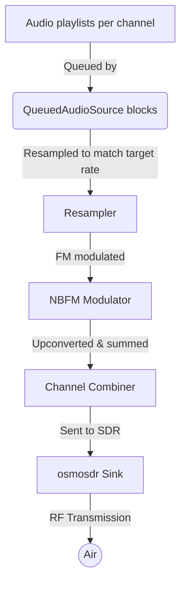

# ATE

Automated test engineering utilities focused on audio and RF experimentation.

## Multi-channel NBFM transmitter

This repository includes a multi-channel narrowband FM transmitter that can
drive HackRF, Pluto SDR, and PlutoPlus SDR devices. The Python flowgraph in
`multich_nbfm_tx.py` lets you queue playlists per-channel, apply per-channel
gains, and stream the composite RF waveform out an `osmosdr` sink.

### High-level workflow

1. Each logical channel keeps a playlist of WAV and/or MP3 files.
2. `QueuedAudioSource` reads the playlists, decodes audio, and performs optional
   sample-rate conversion so every stream matches the transmitter's base
   audio sample rate.
3. Individual channel audio is frequency shifted to its assigned offset or
   direct RF frequency, then modulated as narrowband FM.
4. All modulated channels are summed and forwarded to an `osmosdr` sink which
   pushes complex baseband samples to the connected SDR at the configured
   transmit sample rate and gain.

### Provided entry points

* `multich_nbfm_tx.py` – command-line transmitter that streams per-channel
  file queues (comma-separated file lists), optionally resamples mismatched
  audio sample rates on the fly, exposes per-channel gain trims, looping
  control, and either baseband offsets or direct frequency entry (`--freqs`).
  Additional channel features include:
  * Optional CTCSS tone generation per channel with either a normalized level
    (`--ctcss-level`) or explicit deviation target (`--ctcss-deviation`).
  * Optional DCS (CDCSS) code injection per channel so you can key receivers
    that expect digital squelch signaling.
  * Audio-driven gating (`--gate-open`, `--gate-close`, `--gate-attack-ms`,
    `--gate-release-ms`) that mutes quiet segments before modulation so idle
    channels do not inject unnecessary noise into the composite RF signal.
  * Per-channel configuration summaries printed at start-up for quick
    verification of offsets, gains, tone settings, and estimated bandwidth.
* `multich_gui.py` – lightweight Tkinter GUI that wraps the transmitter so you
  can configure devices, FRS/GMRS channel selections, per-channel playlists,
  and gain levels without memorizing CLI arguments. Core transmitter defaults
  now live in `transmitter_settings.json` so you can tweak them once via the
  GUI's **Settings → Manage Transmitter Settings…** dialog instead of retyping
  CLI overrides every launch. Pass `python multich_gui.py --help` to
  temporarily override any of the saved defaults via CLI flags.
* `ctcss_channel1_squelch.py` – helper utility that reuses the main
  transmitter pipeline to broadcast a continuous CTCSS tone (default 67.0 Hz)
  on channel 1. This is handy for validating that handheld receivers open
  squelch for the configured tone without re-entering full playlists.
* `audio_activity_report.py` – utility that scans WAV/MP3 files and reports
  their audio duty cycle (percentage of chunks whose RMS amplitude exceeds a
  configurable threshold). By default it evaluates one-second chunks with a
  0.1 RMS threshold and writes the CSV summary to `audio_duty_cycle.csv`, but
  you can override any of those settings via CLI flags. Use this to build CSV
  summaries of long playlists before scheduling them for transmission.

### Channel presets

The GUI reads `channel_presets.csv` (bundled in this repository) to populate
its channel picker. Edit that CSV to add, rename, or reorder channels for your
site. Each preset must provide a `frequency_hz` column, and the `display_name`
is shown in the dropdown list.

### Transmitter defaults

`transmitter_settings.json` stores the validated baseline values for TX sample
rate, modulation rate, FM deviation, master scale, tone levels, and squelch
gate thresholds. Use the GUI's Settings menu to edit these values through a
compact dialog. The dialog persists your changes back to the JSON file so
subsequent sessions inherit the tuned defaults without exposing the controls on
the main window.

### HackRF SD Card Export

Use the GUI's **File → Export to SD card…** (or **File → Export for HackRF…** if
you want to pick the destination manually) to generate an SD-card-ready folder.
The export creates a subfolder with this layout:

* `audio/` – WAV/MP3 files copied from each channel playlist (deduplicated when
  multiple channels use the same source file).
* `hackrf_playlist.json` – machine-readable manifest with center frequency,
  sample rates, deviation, gains, tone settings, and per-channel file lists.
* `hackrf_playlist.csv` – human-readable summary of the same channel playlist
  data for quick inspection.

**On-device workflow (playlist export):**

1. Copy the export folder onto the PortaPack SD card (either in the root or in
   your chosen subfolder).
2. On the PortaPack, open the playlist player app, browse to the export folder,
   and load `hackrf_playlist.json` (or use the CSV for quick verification).
3. Start playback to transmit the queued audio files with the saved center
   frequency, per-channel offsets, and gain settings.

**On-device workflow (IQ export):**

1. Choose **Export IQ (PortaPack Replay)** in the export dialog to generate
   `hackrf_multichannel.iq` and `hackrf_iq_manifest.json`.
2. Copy the export folder onto the SD card.
3. On the PortaPack, open **Replay → IQ**, select `hackrf_multichannel.iq`, and
   set the replay parameters to match the manifest:
   * **Center frequency:** `center_frequency_hz` from the manifest.
   * **Sample rate:** `tx_sample_rate` from the manifest.
   * **Format:** 8-bit interleaved IQ (`int8`, `IQ`).
4. Start replay to transmit the captured multichannel composite.

### Dependencies

Both scripts require GNU Radio with `osmosdr` support and NumPy available in
your Python environment. MP3 playlists are supported via the optional
[`audioread`](https://github.com/beetbox/audioread) dependency; install it with
`pip install audioread` if you want to mix MP3 tracks alongside WAV files.
